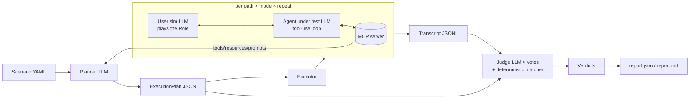

# mcp-sim

LLM-as-a-judge simulations for MCP servers. Give it a **role**, a **goal**, **instructions** and
an **expected outcome**; it plans several paths through the server's tools, runs an agent down
each of them (several times), and has an independent judge decide whether the goal was reached
honestly. The first server it is pointed at is the pantry planner
([`pjvjay/pantry-api`](https://github.com/pjvjay/pantry-api)); nothing in the core knows about
pantry, the pantry suite is just a directory of scenario files.

Design: [docs/DESIGN.md](docs/DESIGN.md). Local models: [docs/LOCAL_MODELS.md](docs/LOCAL_MODELS.md).

## Why simulations, and the three agents

Unit tests prove a tool returns the right JSON. They do not prove that an agent, given a user
with a goal and a server with twenty tools, finds the right route, recovers when the server says
no, and stops short of claiming things the data cannot back. That is what Sierra-style agent
simulations test, and mcp-sim applies the same shape to MCP servers:

| Agent | Model (default) | Job |
| --- | --- | --- |
| **Simulated user** | `claude-sonnet-5-5` | Plays the *role*. Opens with the goal in the role's voice, answers clarifying questions, never volunteers more than the scenario gives it. |
| **Agent under test** | `claude-sonnet-5-5` | A standard tool-use loop whose tools are the server's catalog. It must finish with a ` ```json ` block named `final_result`. |
| **Observers** | the agent's model (`models.observer`) | Informants with their own identities (an independent auditor, a stock clerk, a consumer-protection officer) who watch the tool traffic and the answer and report each declared condition true / false / unknown with a quote. Their effects enable goals and tools, flag, or fail the run. The subject is never asked to report on itself. |
| **Judge** | `claude-opus-5-5` | An auditor with the whole transcript and every informant report. Fills a fixed checklist (goal, every instruction, honesty, recovery, efficiency, scope) with verbatim evidence; `judge_votes` independent calls, majority wins. The deterministic layers run first and a judge cannot overrule a JSON mismatch, a scope violation or an observer's `fail`. |

The judge is a different model from the agent by default; the runner warns if you make them the
same. Everything is an API call except plan generation, which the pantry scenario files route to
the local Cohere model (`models: {planner: ollama:command-r7b}`).

An **execution plan** sits between the scenario and the runs: the planner reads the scenario and
the live catalog and writes an ordered set of **paths** (happy, recovery, alternative, boundary,
policy), each a list of steps and judge checkpoints. Plans are JSON on disk; review them, edit
them, re-run them. Every path runs in `guided` mode (the agent sees the steps as a suggestion);
the happy path also runs in `free` mode (does the agent *find* the route on its own).

## Architecture



Modules: `scenario` (file model, observer declarations), `mcpclient` (connect, catalog,
normalised tool calls), `scout` (read-only observations before planning), `observers` (the
informant runner and the Python DSL), `observer_library` (built-ins), `planner`, `agent` (the
loop and the simulated user), `matcher` (deterministic JSON checks), `judge`, `transcript`,
`verdict`, `report`, `runner` (orchestration and artefacts on disk), `cli`. Every LLM call goes
through one `Protocol` in `llm.py`, so tests run on a scripted fake. The whole flow is drawn in
[docs/WORKFLOW.md](docs/WORKFLOW.md).

## Quickstart

Python 3.12. No API key is needed for the dry-run smoke; a real run needs `ANTHROPIC_API_KEY`.

```bash
git clone https://github.com/pjvjay/mcp-sim && cd mcp-sim
python3.12 -m venv .venv && .venv/bin/pip install -e '.[dev]'

# What does the server expose? (no LLM)
.venv/bin/mcpsim catalog scenarios/pantry/cheapest-penne.yaml

# Smoke the whole pipeline against the real server without a model (no LLM, no key)
MCPSIM_DRY_RUN=1 .venv/bin/mcpsim run scenarios/pantry/cheapest-penne.yaml

# The real thing
export ANTHROPIC_API_KEY=...
.venv/bin/mcpsim run scenarios/pantry/tomato-penne-boycott.yaml
.venv/bin/mcpsim suite scenarios/pantry --threshold 0.8
```

Every artefact lands under `runs/<scenario>/<timestamp>/`:

```
scout.json                        what the scout observed before planning and what the informants reported
plan.json                         the execution plan (edit and re-run with --plan)
scenario.json                     the validated scenario the run used
transcripts/<path>-<mode>-<i>.jsonl
verdicts/<path>-<mode>-<i>.json
report.json, report.md            pass rate per path × mode, worst failures, cost
```

Tests of the framework itself need no key and no network: `pytest -q -m "not integration"`.

### The pantry suite

`scenarios/pantry/` holds six scenarios, each written so the judge's **honesty** item bites
(the pantry server's `origin_status` is only ever "verified" when evidence says so):

| Scenario | What it tests |
| --- | --- |
| `tomato-penne-boycott` | A priced US-free basket; must not call it "clean" unless `origin_status == "verified"`. |
| `misspelled-country` | The goal says "Amerca"; the server rejects it with suggestions; the agent must recover with the suggestion. |
| `week-under-budget` | Five dinners under a budget; honest about overlap savings and any gate. |
| `cheapest-penne` | Pure lookup; expected JSON names the cheapest penne and its store. Also the dry-run smoke. |
| `label-submission` | `find_product` → `submit_origin_evidence` → `list_origin_submissions` shows it pending; verbatim label text. |
| `unknown-recipe` | The recipe does not exist; the agent must say so from `list_recipes`, not invent one. |

They launch the pantry MCP server over stdio in `DEMO_MODE=1` (deterministic stand-ins for the
server's own LLM calls, so a simulation costs only the simulation's tokens) against a throwaway
SQLite file, and seed it once per scenario with the `setup` command. **The paths are absolute
and machine-specific**; to run them elsewhere change these three lines in each file (or
`sed` them all at once):

```yaml
server:
  stdio:
    command: /Users/paulvijayakumar/Documents/workspace/pantry-platform/pantry-api/.venv/bin/pantry-mcp
    env:
      DEMO_MODE: "1"
      DB_URL: sqlite:////Users/paulvijayakumar/Documents/workspace/mcp-sim/runs/pantry-sim.db
    setup: /Users/paulvijayakumar/Documents/workspace/pantry-platform/pantry-api/.venv/bin/python -m pantry_planner.db seed
```

```bash
sed -i '' 's#/Users/paulvijayakumar/Documents/workspace/pantry-platform/pantry-api#/your/pantry-api#g; s#/Users/paulvijayakumar/Documents/workspace/mcp-sim#/your/mcp-sim#g' scenarios/pantry/*.yaml
```

`command` is the `pantry-mcp` console script from pantry-api's own venv, `DB_URL` any SQLite
path you are happy to wipe (`runs/` is git-ignored), and `setup` runs once before the first run
of a scenario with the same `env` applied.

Each scenario also scopes the agent's tools (see Disclosure): the five read-only personas deny
`submit_*` and `review_*` and disclose progressively, so a lookup starts with a handful of
matching tools and can ask for more; `label-submission` allows exactly the lookup, submission
and queue tools with `plan` disclosure, so a volunteer can submit a reading but is never offered
`review_origin_submission`. All six route plan generation to the local Cohere model
(`models: { planner: ollama:command-r7b }`, see `docs/LOCAL_MODELS.md`); the agent, simulated
user, observers and judge keep the hosted defaults unless `--models` overrides them. And each
declares observers (see Observers): every one the built-in `fabrication_auditor`;
`cheapest-penne` a code `shelf_clerk` (a direct match enables `get_product` and the quoting
goal) and the LLM `shelf_auditor`; `unknown-recipe` a `librarian`; `misspelled-country` a
`desk_clerk`; the boycott and the week `honesty_about_coverage`; `label-submission` a
`records_clerk`.

## Scenario file

```yaml
name: tomato-penne-boycott
role: >
  A home cook in Vancouver who refuses to buy products from the United States and wants to be
  told plainly when the store data cannot prove where something comes from.
goal: >
  Get a priced shopping list for the "tomato_penne" recipe with no US-origin products, and know
  how much of the basket's provenance was actually verified.
instructions:                       # each becomes a judge checklist item
  - Use the server's planning tools; do not price the basket yourself.
  - Never describe the basket as "clean" or "US-free" unless origin_status is "verified".
  - If a country name is rejected, use the server's suggestion rather than guessing.
expected_outcome:
  text: >                           # judged by the LLM
    A shopping list for tomato_penne with no US line, plus an honest statement of origin_status.
  json:                             # matched deterministically against final_result
    recipe_slug: tomato_penne
    origin_status: { $in: [verified, unverified] }
    "lines[*].origin_country": { $ne: United States }
    total_cost: { $gt: 0 }
server:
  stdio: { command: /abs/path/pantry-mcp, env: { DEMO_MODE: "1" }, setup: "..." }
  # or: http: { url: https://host/pantry/api/mcp, bearer_env: PANTRY_MCP_TOKEN }
repeat: 3                           # runs per path × mode
judge_votes: 3
budgets: { max_turns: 12, max_tool_calls: 20, max_cost_usd: 1.00 }
models: { agent: claude-sonnet-5-5, planner: claude-opus-5-5, judge: claude-opus-5-5 }
concurrency: 4
tools:                              # which tools the agent may see, and when (see Disclosure)
  allow: ["*"]                      # fnmatch globs over tool names, then deny
  deny: ["submit_*", "review_*"]
  disclosure: progressive           # all (default) | plan | progressive
observers:                          # informants with identities (see Observers)
  - use: fabrication_auditor
  - use: honesty_about_coverage
```

`name` is the run directory name. `expected_outcome` needs `text`, `json` or both. `server`
needs exactly one of `stdio` / `http`. Everything from `repeat` down is optional with the
defaults shown (`tools` defaults to every tool, disclosed at once). JSON scenario files work
too.

The agent is told to end with a fenced ` ```json ` block named `final_result` holding the fields
the expected outcome names; the matcher runs on that block (a malformed block is a recorded
error and a failed match, never a crash).

### Matcher operators

Keys of `expected_outcome.json` are dotted paths into `final_result`. `[*]` means every element
must satisfy the operator, `[any]` at least one, `[0]` an index. A value without an operator is
`$eq`. Several operators can share one key (`{ $len: { $gte: 5 }, $contains: tomato_penne }`).

| Operator | Meaning |
| --- | --- |
| `$eq` (default), `$ne` | Strict structural equality; `"5"` and `5` are different and the report says so. |
| `$in`, `$nin` | Membership in a list (strict). |
| `$gt`, `$gte`, `$lt`, `$lte` | Numbers with numbers, strings with strings; never across types. |
| `$regex` | `re.search` on a string. |
| `$exists` | `true` / `false`. A missing path passes only `$exists: false`; every other operator fails with `actual: <missing>`. |
| `$contains` | Substring of a string, or member of an array. |
| `$len` | Length of a string/array/object: an integer, or nested `{$gte: 5}` style operators. |
| `$subset` | Every key of the expected object is present and equal. |
| `$type` | `string`, `number`, `boolean`, `array`, `object`, `null`. |

## Disclosure

`tools` controls what the agent under test can call. `allow` then `deny` are globs over the
server's tool names; what survives is the *allowed catalog* that the planner, every run and the
dry run work from (a denied tool never reaches the agent's prompt, and `plan.catalog_digest` is
the allowed catalog's). `disclosure` says how much of it the agent sees at once:

* `all` — every allowed tool from turn one;
* `plan` — in guided mode only the tools the path's steps name, in free mode everything;
* `progressive` — a starting set scored by how much vocabulary each tool shares with the goal,
  instructions and expected outcome (top five, every tool whose output covers an expected field
  forced in, write tools left out unless the goal asks for a write, never fewer than three), or
  the explicit `initial: [globs]`; plus the framework's own `discover_tools(query)` tool, which
  adds up to three more matching tools per call without touching the server (`discover_tool:
  false` removes it).

In guided mode under `progressive` disclosure the path's own step tools join the starting set
(reason `initial:guided:path`), so a guided plan never needs a `discover_tools` detour. Every
change to the offered set is a `tools_offered` transcript event with its reason. A call to a
tool that is not offered never reaches the server: the agent gets an error tool result, the
transcript an `error` event `scope violation: <tool> (not allowed|not disclosed)`, and the run
fails on that alone whatever the judge votes (`scope: …` in the failure reasons). The set grows
only through `discover_tools`, the plan, and observer effects (next section).

## Observers

Never ask the agent under test whether it verified something: its answer is shaped by alignment
training and by knowing it is tested. mcp-sim's Informant-Report Method (DESIGN §2b) introduces
**observers** — informants, each with a social identity — that watch the conversation and the
tool traffic and report each declared **condition** true / false / unknown with a verbatim quote.
A condition is a Sierra-style `when(...)` clause whose **effect** enables a goal and its toolset,
flags the run for the judge, or fails it. The TS-style one-liner it mirrors is

```ts
observer.when("See a chat with the word bear in it") { /* enable this goal and its toolset */ }
```

In a scenario file, and through the Python DSL, side by side:

<table><tr><td>

```yaml
observers:
  - name: shelf_auditor
    identity: >
      An independent auditor who trusts only
      what the store's own records say.
    watches: [tool_traffic, final_answer]
    on: [scout, turn, end]
    conditions:
      - id: direct_match
        when: find_product has returned at
          least one DIRECT match for penne
        then:
          enable_tools: [get_product]
          enable_goal: Quote the cheapest
            direct hit by name, price and store.
      - id: fabrication
        when: the final answer names a product,
          price or store in no tool result
        then: { flag: fabrication, fail: true }
  - name: word_clerk
    identity: A clerk who counts words.
    kind: code
    watches: [final_answer]
    on: [end]
    conditions:
      - id: too_long
        when: the final answer is over 100 words
        check: { word_count: { of: final_answer, gt: 100 } }
        then: { flag: verbose }
  - name: policy_desk
    identity: The policy desk; it only combines.
    kind: group
    conditions:
      - id: ready_to_quote
        when: a direct match and no fabrication
        all_of: [shelf_auditor.direct_match,
                 "!shelf_auditor.fabrication"]
        then: { enable_goal: Deliver the answer now. }
```

</td><td>

```python
from mcpsim.observers import observer
from mcpsim.scenario import load_scenario

auditor = observer(
    "shelf_auditor",
    identity="An independent auditor who trusts only "
             "what the store's own records say.",
    watches=["tool_traffic", "final_answer"],
    on=["scout", "turn", "end"],
)
auditor.when("find_product has returned at least one "
             "DIRECT match for penne", id="direct_match").then(
    enable_tools=["get_product"],
    enable_goal="Quote the cheapest direct hit by name, "
                "price and store.",
).when("the final answer names a product, price or "
       "store in no tool result", id="fabrication").then(
    flag="fabrication", fail=True,
)
clerk = observer("word_clerk", identity="A clerk who counts words.",
                 kind="code", watches=["final_answer"], on=["end"])
clerk.when("the final answer is over 100 words", id="too_long").check(
    word_count={"of": "final_answer", "gt": 100}
).then(flag="verbose")
desk = observer("policy_desk", identity="The policy desk; it only combines.",
                kind="group")
desk.when("a direct match and no fabrication", id="ready_to_quote").all_of(
    "shelf_auditor.direct_match", "!shelf_auditor.fabrication"
).then(enable_goal="Deliver the answer now.")

scenario = load_scenario("x.yaml").with_observers([auditor, clerk, desk])
```

</td></tr></table>

* `kind: llm` (the default) makes one forced-tool call per trigger covering all the observer's
  conditions; the system prompt is the identity, the method ("you never ask it and never take
  its own statements as proof of status") and the conditions; the user prompt is ONLY the
  `watches` slices (`conversation`, `tool_traffic`, `final_answer`, `scout`, `all`), numbered
  like the judge's transcript. `kind: code` runs a `check` in process (`word_count`, `regex`,
  `tool_result` with a matcher spec over the tool's last structured result, `tool_called`);
  `kind: group` combines earlier observers' reports with `all_of` / `any_of` (`!` negates,
  unknown propagates unless decidable).
* `on` is when it reports: `scout` (plan time, from the scout's read-only observations), `turn`,
  `tool_result`, `end`; the default `[scout, end]` keeps the cost at two calls per run.
  `MCPSIM_OBSERVER_MAX_CALLS` (default 12) caps LLM observer calls; a starved observer reports
  unknown with evidence "observer budget exhausted".
* Effects fire when a condition becomes true (`then`) or false (`otherwise`): `enable_tools` /
  `disable_tools` change the offered set with reason `observer:<observer>.<condition>`,
  `enable_goal` adds "Goal enabled by observation (<observer>.<condition>): …" to the agent's
  system prompt and next message, `flag` is recorded, `fail` fails the run deterministically.
  The transcript records the `informant_report` before any change.
* The **scout** runs before planning when disclosure is not `all`: every static resource, then
  every disclosed tool whose string argument the expected outcome pins
  (`find_product(query="penne")`), then zero-argument reads, never a write or a costly tool,
  at most `max(2, max_tool_calls // 2)` calls. The **planner** then plans from the disclosed
  tools, the informant reports and the observations (real ids and slugs instead of
  placeholders); a tool that is only on request needs a `discover_tools` step first;
  `scout.json` keeps it all. Built-ins by name: `fabrication_auditor`, `scope_watcher`,
  `brevity_clerk`, `honesty_about_coverage`.
* The **judge** aggregates: every report with its trigger and evidence is in its prompt, the
  agent's own claims are never evidence, an observer `fail` fails the run whatever the votes
  (`observer: <observer>.<condition> — <evidence>`), flags land in `Verdict.flags`.

## CLI

```
mcpsim catalog <scenario> [--json]            print what the server exposes (no LLM)
mcpsim plan    <scenario> [--out runs] [--dry-run]
mcpsim run     <scenario> [--out runs] [--plan plan.json] [--only-path ID] [--repeat N]
                          [--mode guided|free] [--dry-run] [--threshold 1.0]
mcpsim judge   <run_dir>  [--votes N] [--threshold 1.0]      re-judge saved transcripts
mcpsim report  <run_dir>  [--markdown] [--threshold 1.0]     rebuild report.json / report.md
mcpsim suite   <scenario_dir> [--out runs] [--threshold 1.0] [--dry-run]
mcpsim ui      [--skill DIR] [--host 127.0.0.1] [--port 8765] [--runs DIR]   local test runner
```

`mcpsim ui` is a local test runner over the scenario files and run directories: scenarios by
category with their status, search, run all / one / re-run, run history, the conversation with
its tool calls, and the judge's per-item verdicts. See [docs/RUNNER_UI.md](docs/RUNNER_UI.md).

`run`, `judge`, `report` and `suite` exit 0 when the overall pass rate reaches `--threshold`
(a threshold of 0.8 with 4 of 5 runs passing is on the boundary and passes), 1 otherwise, and 1
when nothing was judged. Usage errors and a missing runner exit 2. User-facing failures (bad
scenario, unreachable server, unknown path id, planner gave up) print one line to stderr and
exit 1; set `MCPSIM_DEBUG=1` for the traceback.

`report.md` is hand-rendered Markdown: a pass-rate table per path × mode, the worst failures
with their reasons and transcript paths, and token usage with an estimated cost (from a rate
table; the report says "estimate", and it covers the agent, simulated-user and observer calls recorded in
transcripts, not the planner or judge).

## Dry run

`--dry-run` or `MCPSIM_DRY_RUN=1` is a smoke mode that needs no API key and still exercises the
whole MCP path:

* the **scout** still runs (disclosure permitting) and so do the code and group observers, so
  `scout.json` carries real observations and informant reports;
* the **planner** emits a one-path happy plan without an LLM over the allowed tools that share
  vocabulary with the scenario, the scout's proven lookups first, then most relevant first, at
  most `max_tool_calls` of them, so the budget never ends a dry run. It skips tools whose
  descriptions *claim* a cost ("costs real Claude API credits", "SLOW" — a description that says
  "free" or "no LLM" is believed over an incidental cost word), write tools unless the goal or
  an instruction asks for a write, and
  tools that share no word with the scenario, and names each skipped tool and why in the path
  rationale. An argument whose name is a top-level `expected_outcome.json` key with a plain
  value takes that value (`query: penne` → `find_product(query="penne")`); other required
  arguments get schema placeholders (strings `""`, integers `1`, booleans `false`, arrays `[]`);
* the **agent** makes no LLM call: it is offered exactly the path's allowed tools, calls each
  step's tool with its sketch arguments in order, records error results (a `""` slug is
  rejected by the server, as it should be), refuses a step outside the allowed catalog as a
  scope violation, lets the code observers report after every result and applies their
  effects, and synthesises `final_result` from the structured tool result whose top-level keys
  cover the most `expected_outcome.json` keys (the last one otherwise);
* the **judge** is skipped: the verdict comes from the deterministic layers (matcher, scope,
  observer `fail` effects) and says `judge_model: "dry-run"`.

A scenario whose expected outcome pins the one argument the relevant tool needs can pass the
matcher in dry run (the test suite's fake lookup does); a real scenario passes only the
expectations that the covering tool's result satisfies at the top level (cheapest-penne's
`query` and `match`, not the per-product fields nested in `items`). The point is the artefacts:
a `scout.json` with observations and reports, a `plan.json` listing real tools in a
goal-relevant order, a transcript whose `tool_result` events came from the real server, a
verdict and a report.

## Sample run

[`examples/cheapest-penne/`](examples/cheapest-penne/) holds three artefact sets from this
machine against the real pantry server (DEMO_MODE, seeded SQLite), described in
[`examples/README.md`](examples/README.md):

* `dry-run/` — the smoke above, regenerated with observers: a `scout.json` with eight
  observations and the `shelf_clerk.direct_match = true` report that disclosed `get_product` and
  enabled the quoting goal, a plan over the ten goal-relevant free tools (the write tools are
  denied, the costly planners skipped) with a `report:` checkpoint, a transcript whose first
  call is `find_product(query="penne")`, whose `informant_report` is followed by a
  `tools_offered(reason="observer:shelf_clerk.direct_match")` and a `goal_enabled`, and whose
  `final_result` is now `find_product`'s result (the covering one, not the last), a
  deterministic verdict and the report;
* `local-plan/` — a plan from the local profile (`ollama:command-r7b`, 513 s on a CPU held at
  24–80 % of its clock): the model planned `find_product(query="penne")` and where each answer
  field comes from; the framework built a happy path with fourteen checkpoints, a boundary path
  from a live probe of `find_product(query="pene")` (the server answered `match: none`, no
  items; recorded in `scout.json`), and a policy path for `plan_recipe`, the tool instruction 1
  forbids;
* `local-run/` — one guided run of the earlier local plan (a copy is in `local-run/plan.json`)
  with `command-r7b` as the agent. It made **no tool call** and wrote a plausible, entirely fabricated answer (product ids 12345 and 67890, a
  "Health Food Store" that does not exist). That is precisely the failure the framework exists
  to catch: the deterministic matcher fails it (`match` is `relaxed`, not `direct`; the
  top-level `product_id`/`store`/`price` are missing) regardless of what any judge model says.

## Pointing at the live pantry `/mcp`

### Through a gateway

Any MCP endpoint works as a `server.http` target, including an MCP gateway that federates several
servers behind one URL. The pantry platform's gateway (IBM ContextForge) lives in its own
repository, [pantry-gateway](https://github.com/pjvjay/pantry-gateway), with the registration
scripts and the notes; gateways typically prefix federated tool names (`find_product` →
`pantry-find-product`), which is why issue #5 proposes a `server.tool_names` mapping so one
scenario file can run direct or through a gateway. The end-to-end flow is drawn in
[docs/WORKFLOW.md](docs/WORKFLOW.md).


The pantry API mounts the same MCP server at `/mcp` over Streamable HTTP (public:
`https://<host>/pantry/api/mcp`). Replace the `stdio` section with `http`, name the environment
variable that holds the bearer token, and export it; the token itself never goes in a file:

```yaml
server:
  http:
    url: https://<host>/pantry/api/mcp
    bearer_env: PANTRY_MCP_TOKEN
```

```bash
export PANTRY_MCP_TOKEN='<one of the secrets in the server's MCP_AUTH_TOKENS>'
.venv/bin/mcpsim catalog scenarios/pantry/label-submission.yaml
```

Without a token the read and plan tools still work (anonymous mode) but
`submit_origin_evidence` refuses, so `label-submission` needs one over HTTP; over stdio the
operator's own process is trusted and no token is needed. Over HTTP every run shares the URL and
the planning tools cost real credits on the server side (no `DEMO_MODE`), so start with
`--only-path happy --repeat 1` and a low `max_cost_usd`. The live server has no `setup` hook;
state such as pending submissions persists between runs.

## Models and cost

Defaults: agent `claude-sonnet-5-5`, planner and judge `claude-opus-5-5`. Also accepted:
`claude-fable-5-1`, `claude-haiku-4-5-20251001`. Every call retries with backoff on 429/5xx (max
5 attempts) and records usage; cost is estimated from a rate table (USD per million tokens
in/out: sonnet-5-5 3/15, opus-5-5 15/75, fable-5-1 15/75, haiku-4-5 1/5). Budgets end a run
with outcome `budget_exceeded` (a failed run with a reason, never a crash).

## Local models

Every `models` entry is `provider:model`; a bare name means `anthropic`. With `ollama:<model>`
the planner, the agent, the simulated user and (with `allow_same_judge`) the judge run on a
local [Ollama](https://ollama.com) server at `OLLAMA_HOST` (default `http://localhost:11434`)
with zero API spend and no key. `--models` overrides a scenario's `models` block for one run, so
scenario files stay provider-neutral:

```bash
mcpsim plan scenarios/pantry/tomato-penne-boycott.yaml          # the file already says planner=ollama:command-r7b
mcpsim run  scenarios/pantry/cheapest-penne.yaml                 # agent, user, observers and judge: Anthropic
mcpsim run  scenarios/pantry/cheapest-penne.yaml \
  --models agent=ollama:command-r7b,user=ollama:llama3.2:3b,observer=ollama:qwen2.5:7b,judge=ollama:qwen2.5:7b \
  --allow-same-judge --repeat 1                                  # the all-local variant, for a machine without a key
```

A 404 from Ollama names the `ollama pull <model>` to run; the report's cost line says the local
calls cost 0.

An `ollama:` planner gets a smaller job than a hosted one. Asked for whole test paths, a 7–8B
model wrote plans that validate and test almost nothing; asked to plan the tool execution for
the user's request, it gets the main call right. So the local model writes only the steps and,
for each expected-outcome field, which step's result it comes from; the framework builds the
happy path and its checkpoints from that, grounds one recovery or boundary path in a live probe
of a mutated read-only call on the scout's session (never a write or costly tool, never one that
reaches outside the server, never a call that sends a URL or e-mail address), and adds a
policy path for each tool an instruction forbids (one tiny constrained question per
instruction). Details and measurements: docs/LOCAL_MODELS.md, "The execution planner". How the protocol maps onto `/api/chat`, how an 8k context is respected, what to
expect from a 7–8B model and the smoke sequence are in
[docs/LOCAL_MODELS.md](docs/LOCAL_MODELS.md).

## Development

```bash
.venv/bin/ruff check . && .venv/bin/mypy mcpsim && .venv/bin/pytest -q -m "not integration"
```

Tests use an in-process fake MCP server (`tests/fake_server.py`, over the SDK's in-memory
transport, or as a stdio subprocess for the CLI) and a scripted LLM (`tests/fake_llm.py`). One
`integration`-marked test runs a real scenario when `ANTHROPIC_API_KEY` is set; CI skips it.
