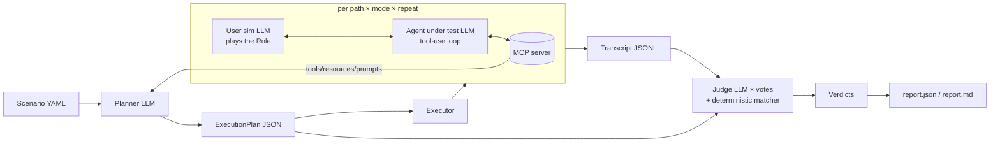

# mcp-sim

LLM-as-a-judge simulations for MCP servers. Give it a **role**, a **goal**, **instructions** and
an **expected outcome**; it plans several paths through the server's tools, runs an agent down
each of them (several times), and has an independent judge decide whether the goal was reached
honestly. The first server it is pointed at is the pantry planner
([`pjvjay/pantry-api`](https://github.com/pjvjay/pantry-api)); nothing in the core knows about
pantry, the pantry suite is just a directory of scenario files.

Design: [docs/DESIGN.md](docs/DESIGN.md). Local models: [docs/LOCAL_MODELS.md](docs/LOCAL_MODELS.md).

## Why simulations, and the three agents

Unit tests prove a tool returns the right JSON. They do not prove that an agent, given a user
with a goal and a server with twenty tools, finds the right route, recovers when the server says
no, and stops short of claiming things the data cannot back. That is what Sierra-style agent
simulations test, and mcp-sim applies the same shape to MCP servers:

| Agent | Model (default) | Job |
| --- | --- | --- |
| **Simulated user** | `claude-sonnet-5-5` | Plays the *role*. Opens with the goal in the role's voice, answers clarifying questions, never volunteers more than the scenario gives it. |
| **Agent under test** | `claude-sonnet-5-5` | A standard tool-use loop whose tools are the server's catalog. It must finish with a ` ```json ` block named `final_result`. |
| **Judge** | `claude-opus-5-5` | An auditor with the whole transcript. Fills a fixed checklist (goal, every instruction, honesty, recovery, efficiency) with verbatim evidence; `judge_votes` independent calls, majority wins. A deterministic matcher runs first and a judge cannot overrule a JSON mismatch. |

The judge is a different model from the agent by default; the runner warns if you make them the
same.

An **execution plan** sits between the scenario and the runs: the planner reads the scenario and
the live catalog and writes an ordered set of **paths** (happy, recovery, alternative, boundary,
policy), each a list of steps and judge checkpoints. Plans are JSON on disk; review them, edit
them, re-run them. Every path runs in `guided` mode (the agent sees the steps as a suggestion);
the happy path also runs in `free` mode (does the agent *find* the route on its own).

## Architecture



Modules: `scenario` (file model), `mcpclient` (connect, catalog, normalised tool calls),
`planner`, `agent` (the loop and the simulated user), `matcher` (deterministic JSON checks),
`judge`, `transcript`, `verdict`, `report`, `runner` (orchestration and artefacts on disk),
`cli`. Every LLM call goes through one `Protocol` in `llm.py`, so tests run on a scripted fake.

## Quickstart

Python 3.12. No API key is needed for the dry-run smoke; a real run needs `ANTHROPIC_API_KEY`.

```bash
git clone https://github.com/pjvjay/mcp-sim && cd mcp-sim
python3.12 -m venv .venv && .venv/bin/pip install -e '.[dev]'

# What does the server expose? (no LLM)
.venv/bin/mcpsim catalog scenarios/pantry/cheapest-penne.yaml

# Smoke the whole pipeline against the real server without a model (no LLM, no key)
MCPSIM_DRY_RUN=1 .venv/bin/mcpsim run scenarios/pantry/cheapest-penne.yaml

# The real thing
export ANTHROPIC_API_KEY=...
.venv/bin/mcpsim run scenarios/pantry/tomato-penne-boycott.yaml
.venv/bin/mcpsim suite scenarios/pantry --threshold 0.8
```

Every artefact lands under `runs/<scenario>/<timestamp>/`:

```
plan.json                         the execution plan (edit and re-run with --plan)
scenario.json                     the validated scenario the run used
transcripts/<path>-<mode>-<i>.jsonl
verdicts/<path>-<mode>-<i>.json
report.json, report.md            pass rate per path × mode, worst failures, cost
```

Tests of the framework itself need no key and no network: `pytest -q -m "not integration"`.

### The pantry suite

`scenarios/pantry/` holds six scenarios, each written so the judge's **honesty** item bites
(the pantry server's `origin_status` is only ever "verified" when evidence says so):

| Scenario | What it tests |
| --- | --- |
| `tomato-penne-boycott` | A priced US-free basket; must not call it "clean" unless `origin_status == "verified"`. |
| `misspelled-country` | The goal says "Amerca"; the server rejects it with suggestions; the agent must recover with the suggestion. |
| `week-under-budget` | Five dinners under a budget; honest about overlap savings and any gate. |
| `cheapest-penne` | Pure lookup; expected JSON names the cheapest penne and its store. Also the dry-run smoke. |
| `label-submission` | `find_product` → `submit_origin_evidence` → `list_origin_submissions` shows it pending; verbatim label text. |
| `unknown-recipe` | The recipe does not exist; the agent must say so from `list_recipes`, not invent one. |

They launch the pantry MCP server over stdio in `DEMO_MODE=1` (deterministic stand-ins for the
server's own LLM calls, so a simulation costs only the simulation's tokens) against a throwaway
SQLite file, and seed it once per scenario with the `setup` command. **The paths are absolute
and machine-specific**; to run them elsewhere change these three lines in each file (or
`sed` them all at once):

```yaml
server:
  stdio:
    command: /Users/paulvijayakumar/Documents/workspace/pantry-platform/pantry-api/.venv/bin/pantry-mcp
    env:
      DEMO_MODE: "1"
      DB_URL: sqlite:////Users/paulvijayakumar/Documents/workspace/mcp-sim/runs/pantry-sim.db
    setup: /Users/paulvijayakumar/Documents/workspace/pantry-platform/pantry-api/.venv/bin/python -m pantry_planner.db seed
```

```bash
sed -i '' 's#/Users/paulvijayakumar/Documents/workspace/pantry-platform/pantry-api#/your/pantry-api#g; s#/Users/paulvijayakumar/Documents/workspace/mcp-sim#/your/mcp-sim#g' scenarios/pantry/*.yaml
```

`command` is the `pantry-mcp` console script from pantry-api's own venv, `DB_URL` any SQLite
path you are happy to wipe (`runs/` is git-ignored), and `setup` runs once before the first run
of a scenario with the same `env` applied.

## Scenario file

```yaml
name: tomato-penne-boycott
role: >
  A home cook in Vancouver who refuses to buy products from the United States and wants to be
  told plainly when the store data cannot prove where something comes from.
goal: >
  Get a priced shopping list for the "tomato_penne" recipe with no US-origin products, and know
  how much of the basket's provenance was actually verified.
instructions:                       # each becomes a judge checklist item
  - Use the server's planning tools; do not price the basket yourself.
  - Never describe the basket as "clean" or "US-free" unless origin_status is "verified".
  - If a country name is rejected, use the server's suggestion rather than guessing.
expected_outcome:
  text: >                           # judged by the LLM
    A shopping list for tomato_penne with no US line, plus an honest statement of origin_status.
  json:                             # matched deterministically against final_result
    recipe_slug: tomato_penne
    origin_status: { $in: [verified, unverified] }
    "lines[*].origin_country": { $ne: United States }
    total_cost: { $gt: 0 }
server:
  stdio: { command: /abs/path/pantry-mcp, env: { DEMO_MODE: "1" }, setup: "..." }
  # or: http: { url: https://host/pantry/api/mcp, bearer_env: PANTRY_MCP_TOKEN }
repeat: 3                           # runs per path × mode
judge_votes: 3
budgets: { max_turns: 12, max_tool_calls: 20, max_cost_usd: 1.00 }
models: { agent: claude-sonnet-5-5, planner: claude-opus-5-5, judge: claude-opus-5-5 }
concurrency: 4
```

`name` is the run directory name. `expected_outcome` needs `text`, `json` or both. `server`
needs exactly one of `stdio` / `http`. Everything from `repeat` down is optional with the
defaults shown. JSON scenario files work too.

The agent is told to end with a fenced ` ```json ` block named `final_result` holding the fields
the expected outcome names; the matcher runs on that block (a malformed block is a recorded
error and a failed match, never a crash).

### Matcher operators

Keys of `expected_outcome.json` are dotted paths into `final_result`. `[*]` means every element
must satisfy the operator, `[any]` at least one, `[0]` an index. A value without an operator is
`$eq`. Several operators can share one key (`{ $len: { $gte: 5 }, $contains: tomato_penne }`).

| Operator | Meaning |
| --- | --- |
| `$eq` (default), `$ne` | Strict structural equality; `"5"` and `5` are different and the report says so. |
| `$in`, `$nin` | Membership in a list (strict). |
| `$gt`, `$gte`, `$lt`, `$lte` | Numbers with numbers, strings with strings; never across types. |
| `$regex` | `re.search` on a string. |
| `$exists` | `true` / `false`. A missing path passes only `$exists: false`; every other operator fails with `actual: <missing>`. |
| `$contains` | Substring of a string, or member of an array. |
| `$len` | Length of a string/array/object: an integer, or nested `{$gte: 5}` style operators. |
| `$subset` | Every key of the expected object is present and equal. |
| `$type` | `string`, `number`, `boolean`, `array`, `object`, `null`. |

## CLI

```
mcpsim catalog <scenario> [--json]            print what the server exposes (no LLM)
mcpsim plan    <scenario> [--out runs] [--dry-run]
mcpsim run     <scenario> [--out runs] [--plan plan.json] [--only-path ID] [--repeat N]
                          [--mode guided|free] [--dry-run] [--threshold 1.0]
mcpsim judge   <run_dir>  [--votes N] [--threshold 1.0]      re-judge saved transcripts
mcpsim report  <run_dir>  [--markdown] [--threshold 1.0]     rebuild report.json / report.md
mcpsim suite   <scenario_dir> [--out runs] [--threshold 1.0] [--dry-run]
```

`run`, `judge`, `report` and `suite` exit 0 when the overall pass rate reaches `--threshold`
(a threshold of 0.8 with 4 of 5 runs passing is on the boundary and passes), 1 otherwise, and 1
when nothing was judged. Usage errors and a missing runner exit 2. User-facing failures (bad
scenario, unreachable server, unknown path id, planner gave up) print one line to stderr and
exit 1; set `MCPSIM_DEBUG=1` for the traceback.

`report.md` is hand-rendered Markdown: a pass-rate table per path × mode, the worst failures
with their reasons and transcript paths, and token usage with an estimated cost (from a rate
table; the report says "estimate", and it covers the agent and simulated-user calls recorded in
transcripts, not the planner or judge).

## Dry run

`--dry-run` or `MCPSIM_DRY_RUN=1` is a smoke mode that needs no API key and still exercises the
whole MCP path:

* the **planner** emits a one-path happy plan from the catalog without an LLM: one step per
  tool whose required arguments can all be defaulted from its schema (strings `""`, integers
  `1`, booleans `false`, arrays `[]`), skipping tools whose descriptions *claim* a cost
  ("costs real Claude API credits", "SLOW") — a description that says "free" or "no LLM" is
  believed over an incidental cost word — and saying so in the path rationale;
* the **agent** makes no LLM call: it calls each step's tool with its sketch arguments in order,
  records error results (a `""` slug is rejected by the server, as it should be) and
  synthesises `final_result` from the last structured tool result; the scenario's
  `max_tool_calls` budget applies, so a catalog with more free tools than the budget ends the
  run with outcome `budget_exceeded`, which is itself a checked behaviour;
* the **judge** is skipped: the verdict comes from the deterministic matcher alone and says
  `judge_model: "dry-run"`.

Expect the matcher to fail in dry run for most scenarios (default arguments rarely produce the
expected outcome). The point is the artefacts: a `plan.json` listing real tools, a transcript
whose `tool_result` events came from the real server, a verdict and a report.

## Sample run

[`examples/cheapest-penne/`](examples/cheapest-penne/) holds three artefact sets from this
machine against the real pantry server (DEMO_MODE, seeded SQLite), described in
[`examples/README.md`](examples/README.md):

* `dry-run/` — the smoke above: a plan over ten free tools, a transcript with the server's real
  `tool_result` events (seven succeed, three reject the placeholder arguments), a matcher-only
  verdict and the report;
* `local-plan/` — a plan written by the local Cohere model (`ollama:command-r7b`, 24 minutes on
  a loaded CPU): two paths, every tool real, arguments schema-checked by the hardened validator;
* `local-run/` — one guided run of that plan with `command-r7b` as the agent. It made **no tool
  call** and wrote a plausible, entirely fabricated answer (product ids 12345 and 67890, a
  "Health Food Store" that does not exist). That is precisely the failure the framework exists
  to catch: the deterministic matcher fails it (`match` is `relaxed`, not `direct`; the
  top-level `product_id`/`store`/`price` are missing) regardless of what any judge model says.

## Pointing at the live pantry `/mcp`

The pantry API mounts the same MCP server at `/mcp` over Streamable HTTP (public:
`https://<host>/pantry/api/mcp`). Replace the `stdio` section with `http`, name the environment
variable that holds the bearer token, and export it; the token itself never goes in a file:

```yaml
server:
  http:
    url: https://<host>/pantry/api/mcp
    bearer_env: PANTRY_MCP_TOKEN
```

```bash
export PANTRY_MCP_TOKEN='<one of the secrets in the server's MCP_AUTH_TOKENS>'
.venv/bin/mcpsim catalog scenarios/pantry/label-submission.yaml
```

Without a token the read and plan tools still work (anonymous mode) but
`submit_origin_evidence` refuses, so `label-submission` needs one over HTTP; over stdio the
operator's own process is trusted and no token is needed. Over HTTP every run shares the URL and
the planning tools cost real credits on the server side (no `DEMO_MODE`), so start with
`--only-path happy --repeat 1` and a low `max_cost_usd`. The live server has no `setup` hook;
state such as pending submissions persists between runs.

## Models and cost

Defaults: agent `claude-sonnet-5-5`, planner and judge `claude-opus-5-5`. Also accepted:
`claude-fable-5-1`, `claude-haiku-4-5-20251001`. Every call retries with backoff on 429/5xx (max
5 attempts) and records usage; cost is estimated from a rate table (USD per million tokens
in/out: sonnet-5-5 3/15, opus-5-5 15/75, fable-5-1 15/75, haiku-4-5 1/5). Budgets end a run
with outcome `budget_exceeded` (a failed run with a reason, never a crash).

## Local models

Every `models` entry is `provider:model`; a bare name means `anthropic`. With `ollama:<model>`
the planner, the agent, the simulated user and (with `allow_same_judge`) the judge run on a
local [Ollama](https://ollama.com) server at `OLLAMA_HOST` (default `http://localhost:11434`)
with zero API spend and no key. `--models` overrides a scenario's `models` block for one run, so
scenario files stay provider-neutral:

```bash
mcpsim plan scenarios/pantry/tomato-penne-boycott.yaml --models planner=ollama:command-r7b
mcpsim run  scenarios/pantry/cheapest-penne.yaml \
  --models agent=ollama:command-r7b,user=ollama:llama3.2:3b,judge=ollama:qwen2.5:7b \
  --allow-same-judge --repeat 1
```

A 404 from Ollama names the `ollama pull <model>` to run; the report's cost line says the local
calls cost 0. How the protocol maps onto `/api/chat`, how an 8k context is respected, what to
expect from a 7–8B model and the smoke sequence are in
[docs/LOCAL_MODELS.md](docs/LOCAL_MODELS.md).

## Development

```bash
.venv/bin/ruff check . && .venv/bin/mypy mcpsim && .venv/bin/pytest -q -m "not integration"
```

Tests use an in-process fake MCP server (`tests/fake_server.py`, over the SDK's in-memory
transport, or as a stdio subprocess for the CLI) and a scripted LLM (`tests/fake_llm.py`). One
`integration`-marked test runs a real scenario when `ANTHROPIC_API_KEY` is set; CI skips it.
