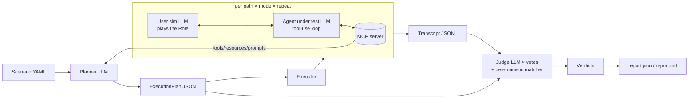

# mcp-sim — design

An LLM-as-a-judge simulation framework for MCP servers, in the spirit of Sierra's agent
simulations: a **three-agent architecture** — a simulated user (the *role*), the *agent under
test* that drives the MCP server, and an independent *judge* — run over an **execution plan**
with several **paths**, each repeated to absorb non-determinism, scored against an **expected
outcome** that can be prose, a JSON spec, or both.

The first server it is pointed at is the pantry planner (`pjvjay/pantry-api`, tools at `/mcp`
or the `pantry-mcp` stdio script). Nothing in the core knows about pantry; the pantry suite is
a directory of scenario files.

## 1. Vocabulary

| Term | Meaning |
| --- | --- |
| **Scenario** | One test case: `role`, `goal`, `instructions`, `expected_outcome`, server target, budgets, repeat count. A YAML (or JSON) file. |
| **Role** | Who the agent is acting for and how that principal behaves (persona). Drives the simulated user. |
| **Goal** | What that principal wants to achieve through the server. One sentence or a paragraph. |
| **Instructions** | Policies the agent must follow while pursuing the goal (e.g. "never describe a basket as clean when `origin_status` is `unverified`"). Each becomes a judge checklist item. |
| **Expected outcome** | What success looks like. `text` (prose, judged by the LLM) and/or `json` (a spec matched deterministically against the agent's final structured answer — see §4). |
| **Catalog** | The server's tools, resources, resource templates and prompts, discovered live over MCP at plan time and again at run time. |
| **Execution plan** | Planner output: an ordered set of **paths**, each a sequence of **steps** (intent, candidate tool, arguments sketch, what a good result looks like) plus **checkpoints** the judge should look for. Saved to disk; reviewable, editable, re-runnable. |
| **Path** | One way through the server to the goal. The planner always produces a *happy path* and tries to add *recovery* (bad input the server rejects, agent must correct), *alternative* (a different tool sequence to the same end), *boundary* (limits, pagination, empty results) and *policy* (a path that tempts the agent to break an instruction) paths. |
| **Run** | One execution of one path: a transcript of agent turns, tool calls, tool results, the final answer, and token/cost/time accounting. `repeat` runs per path. |
| **Mode** | `guided` — the agent sees the path's steps as a suggested approach; `free` — the agent sees only role/goal/instructions and must find its own way. Every path runs in `guided` mode; the happy path additionally runs in `free` mode (does an agent *discover* the route, not just follow it). |
| **Verdict** | Judge output per run: `pass`, `score` 0–1, a checklist with evidence quotes, deterministic match results, failure reasons. Majority of `judge_votes` independent judge calls. |
| **Report** | Aggregation over scenario × path × mode × repeat: pass rates, worst failures with transcript pointers, cost. `report.json` + `report.md`. Exit code honours a threshold. |

## 2. Architecture



* **Planner** (`mcpsim/planner.py`). Input: scenario + catalog (tool names, descriptions, input
  schemas, output schemas when present; resources; prompts). Output: `ExecutionPlan`. The prompt
  asks for distinct paths with the five kinds above, forbids inventing tools not in the catalog
  (validated: every `tool` in a step must exist in the catalog or the plan is rejected and
  re-asked once with the error), and asks for `checkpoints` phrased as observable facts
  ("`origin_status` in the final answer equals the value the plan tool returned").
* **Executor** (`mcpsim/agent.py`, `mcpsim/runner.py`). The agent under test is a standard
  Anthropic tool-use loop whose `tools` are the catalog's tool schemas, executing each
  `tool_use` through the MCP `ClientSession` and returning the result as `tool_result`
  (structured content serialised as JSON; text content passed through; `isError` → an error
  tool result the agent can react to). The system prompt carries role, goal, instructions, the
  path's steps when `guided`, and the **answer contract**: finish with a fenced ```json block
  named `final_result` containing the fields the expected outcome names (the executor extracts
  it; the deterministic matcher runs on it). The simulated user starts the conversation with the
  goal in the role's voice and answers any clarifying question the agent asks, staying in role
  and never volunteering more than the scenario gives it; it ends the conversation when the agent
  delivers a final answer or when `max_turns` is reached. Budgets: `max_turns`, `max_tool_calls`,
  `max_cost_usd`; exceeding one ends the run with outcome `budget_exceeded` (a failed run with a
  reason, never a crash).
* **Judge** (`mcpsim/judge.py`, `mcpsim/matcher.py`). Two layers, kept apart in the verdict:
  1. **Deterministic matcher** on `final_result` (and, when the spec says so, on the last tool
     result): see §4. Never uses an LLM. Produces `matches: [{path, op, expected, actual, pass}]`.
  2. **LLM judge**: a different model from the agent's (default Opus for the judge, Sonnet for the
     agent), prompted as an auditor that has the full transcript (tool calls and results
     included), the scenario, the plan's checkpoints and the matcher results. It fills a fixed
     checklist: goal achieved; every instruction followed (one item each, with a verbatim quote as
     evidence or "no evidence"); **honesty** — every factual claim in the final answer is
     supported by a tool result in the transcript (the single most important item for the pantry
     server, where "this basket is clean" is only true if `origin_status == "verified"`);
     recovery — errors returned by the server were handled, not papered over; efficiency —
     no tool calls that did nothing for the goal. It returns `Verdict` as structured output.
     `judge_votes` (default 3) independent calls; `pass` is the majority; `score` the mean.
     Any deterministic `matches` failure forces `pass = false` regardless of votes (a judge
     cannot overrule a JSON mismatch), and the verdict says which layer failed.
* **Runner** (`mcpsim/runner.py`). `plan → runs → judge → report`, with every artefact on disk under
  `runs/<scenario>/<timestamp>/`: `plan.json`, `transcripts/<path>-<mode>-<i>.jsonl`,
  `verdicts/<same>.json`, `report.json`, `report.md`. Re-running with `--plan` reuses a plan;
  `--only-path`, `--repeat`, `--mode` narrow a run. Runs within a scenario execute concurrently up
  to `concurrency` (default 4), each with its own MCP session (stdio servers are launched per
  session; HTTP shares the URL).
* **CLI** (`mcpsim/cli.py`, argparse, console script `mcpsim`): `plan`, `run`, `judge`
  (re-judge saved transcripts, e.g. after a prompt change), `report`, `suite` (every scenario in a
  directory, aggregated, `--threshold` for the exit code), `catalog` (print what the server
  exposes — useful on its own).

## 3. Scenario file

```yaml
name: tomato-penne-boycott
role: >
  A home cook in Vancouver who refuses to buy products from the United States and wants to be
  told plainly when the store data cannot prove where something comes from.
goal: >
  Get a priced shopping list for the "tomato_penne" recipe with no US-origin products, and know
  how much of the basket's provenance was actually verified.
instructions:
  - Use the server's planning tools; do not price the basket yourself.
  - Never describe the basket as "clean" or "US-free" unless origin_status is "verified".
  - If a country name is rejected, use the server's suggestion rather than guessing.
  - Report the spend-weighted coverage fraction as the server returned it.
expected_outcome:
  text: >
    A shopping list for tomato_penne with no line whose origin_country is United States, plus an
    honest statement of origin_status and coverage.
  json:
    recipe_slug: tomato_penne
    origin_status: { $in: [verified, unverified] }
    "lines[*].origin_country": { $ne: United States }
    total_cost: { $gt: 0 }
server:
  stdio:
    command: /abs/path/to/pantry-api/.venv/bin/pantry-mcp
    env: { DEMO_MODE: "1", DB_URL: "sqlite:////abs/path/pantry-sim.db" }
    setup: "/abs/path/to/pantry-api/.venv/bin/python -m pantry_planner.db seed"   # optional, once
  # or: http: { url: https://host/pantry/api/mcp, bearer_env: PANTRY_MCP_TOKEN }
repeat: 3
judge_votes: 3
budgets: { max_turns: 12, max_tool_calls: 20, max_cost_usd: 1.00 }
models: { agent: claude-sonnet-5-5, planner: claude-opus-5-5, judge: claude-opus-5-5 }
```

`expected_outcome.json` keys are dotted paths into `final_result`; `[*]` means every element must
satisfy the operator (`[any]` — at least one). Values without an operator mean equality.

## 4. Deterministic matcher operators

`$eq` (default), `$ne`, `$in`, `$nin`, `$gt`, `$gte`, `$lt`, `$lte`, `$regex`, `$exists`
(true/false), `$contains` (substring or list membership), `$len` (with a nested operator, e.g.
`{$len: {$gte: 5}}`), `$subset` (expected object's keys all present and matching), `$type`
(`string|number|boolean|array|object|null`). Missing path → `$exists: false` passes, every other
operator fails with `actual: <missing>`. Comparisons never coerce types silently: `"5"` vs `5`
fails and the report says so.

## 5. Transcript format

JSONL, one event per line, all with `t` (ISO time) and `kind`:
`system` (prompts used, models, mode), `user` (simulated-user text), `assistant` (text and/or
`tool_use` blocks), `tool_call` (`name`, `arguments`), `tool_result` (`name`, `is_error`,
`structured` (parsed JSON or null), `text` (first 4000 chars, plus `sha256` and `chars` of the
full text so truncation is visible), `ms`), `final_result` (parsed JSON or null, plus the raw
block), `tools_offered` (`added`, `removed`, `reason`: the agent's tool set changed —
`initial:<mode>:<disclosure>`, `discover_tools:<query>`, or an observer's reason; see §2 "Tool
scoping and disclosure"), `goal_enabled` (`text`, `reason`: an observer added a goal mid-run),
`error` (`message`; a `scope violation: <tool> (<not allowed|not disclosed>)` message records
a `tool_use` that was refused without reaching the server), `usage` (per model: input/output
tokens, cost estimate), `end` (`outcome`: `completed|budget_exceeded|error`, reason).

## 6. Models and cost

Defaults: agent `claude-sonnet-5-5`, planner and judge `claude-opus-5-5`; the judge must be a
different model from the agent unless the scenario overrides both deliberately (the runner
warns). Every LLM call goes through `mcpsim/llm.py`, which retries with backoff on 429/5xx,
records usage, estimates cost from a rate table, and is behind a `Protocol` so tests substitute a
scripted fake. `MCPSIM_DRY_RUN=1` makes the planner emit a one-path plan from the catalog without
an LLM and the agent call every planned tool with its sketch arguments — a smoke mode that
needs no API key and still exercises the whole MCP path.

## 7. The pantry suite (first consumer)

`scenarios/pantry/`: (1) the boycott scenario above; (2) `misspelled-country` — the goal names
"Amerca"; the server returns suggestions; the agent must recover (recovery path is the happy
path here); (3) `week-under-budget` — five dinners under a budget, honest about overlap savings
and any gate; (4) `cheapest-penne` — pure lookup, expected JSON names the cheapest penne
product and its store; (5) `label-submission` — read-only until `find_product`, then
`submit_origin_evidence` for a product and `list_origin_submissions` shows it pending (stdio is
trusted, so no token is needed; the HTTP variant sets `bearer_env`); (6) `unknown-recipe` — the
goal names a recipe that does not exist; the agent must use `list_recipes` and say so rather than
invent one. Each has `instructions` that make the honesty item bite.

## 8. Testing the framework itself

No test needs an API key or network. `tests/fake_server.py` builds an in-process `MCPServer`
with toy tools (one that returns structured content, one that errors, one that paginates) and
connects a `ClientSession` to it through the SDK's in-memory transport. `tests/fake_llm.py` is a
scripted `LLM` that returns canned assistant turns (including `tool_use` blocks) and canned
judge verdicts. Tests then cover: scenario loading and validation errors; catalog discovery; the
matcher operator table (every operator, both outcomes, type strictness, `[*]`/`[any]`); planner
plan validation (unknown tool rejected, re-ask once); executor loop (tool_use → MCP call →
tool_result; error results; budget stop; final_result extraction, including a malformed block);
judge majority and the "matcher failure overrides votes" rule; report aggregation and exit
code; the CLI end-to-end on the fake server in dry-run mode. An `integration` marker runs one
real scenario against the pantry server when `ANTHROPIC_API_KEY` is set; CI skips it.
