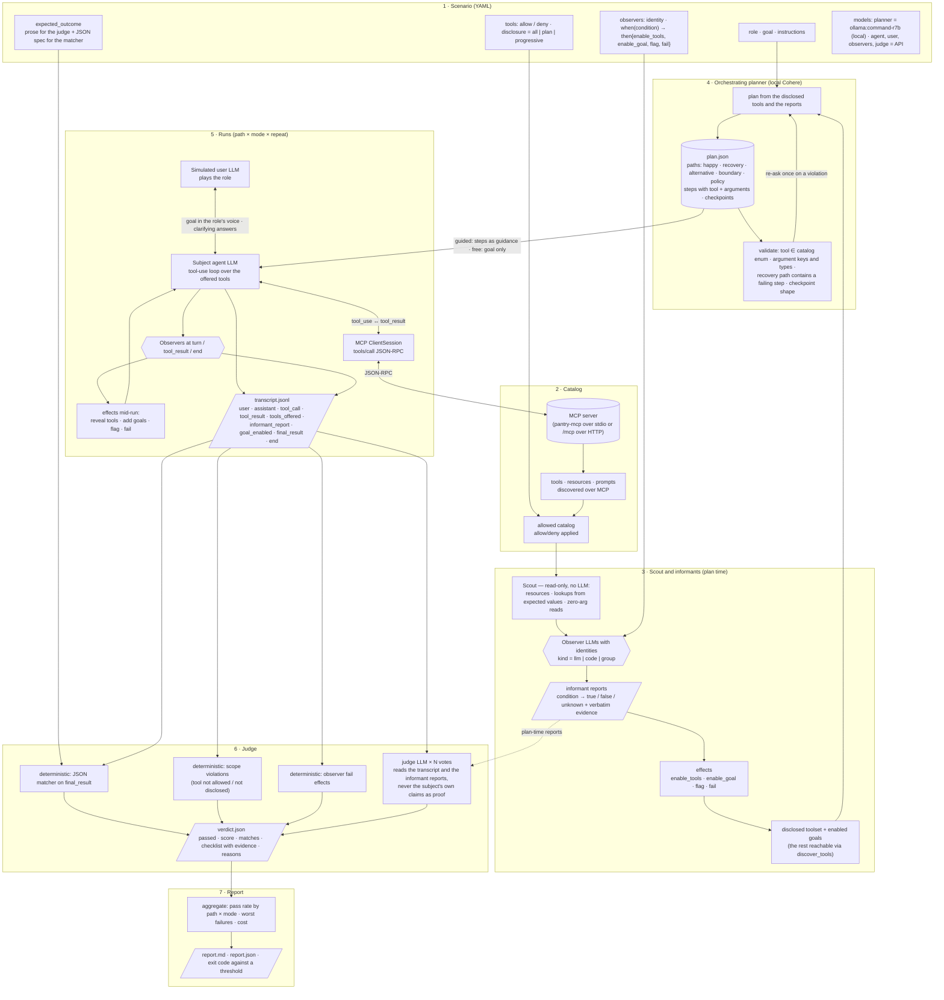
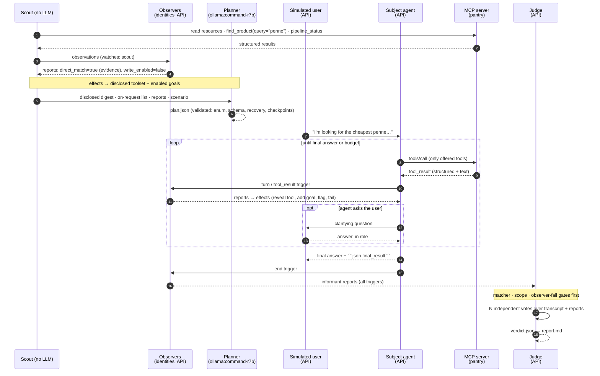

# How an mcp-sim simulation flows

Two views of the same thing: the end-to-end pipeline from a scenario file to a report, and one run seen
as a sequence. Vocabulary is defined in [DESIGN.md](DESIGN.md); the observer model is the
Informant-Report Method (observers with their own identities report on the subject; the subject is never
asked to report on itself).

## End to end

Reading it: the matcher, the scope check and observer `fail` effects are hard gates; a judge vote can
never overturn them. Disclosure only ever grows for a stated reason (`discover_tools`, a plan step, or an
observer effect), and every change is a transcript event the judge can read. In dry run the LLM boxes are
skipped: the scout and code observers still run, the agent walks the plan mechanically, and the verdict
comes from the deterministic layers alone.

## One run as a sequence

